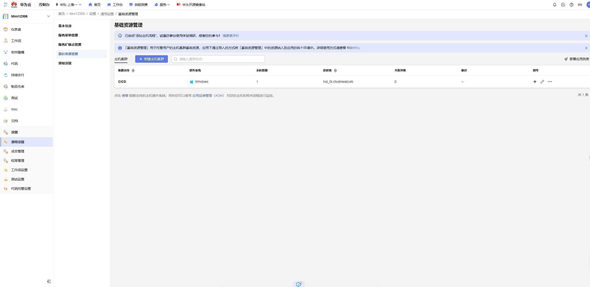
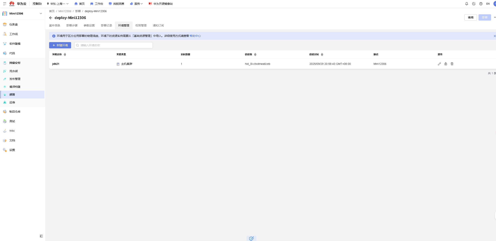
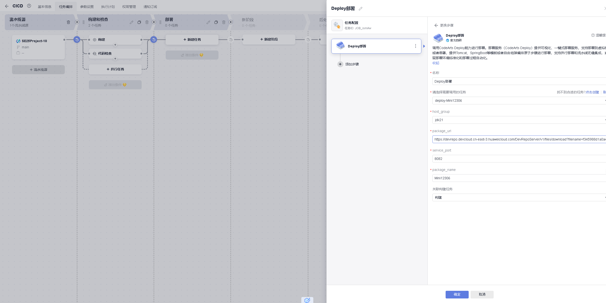
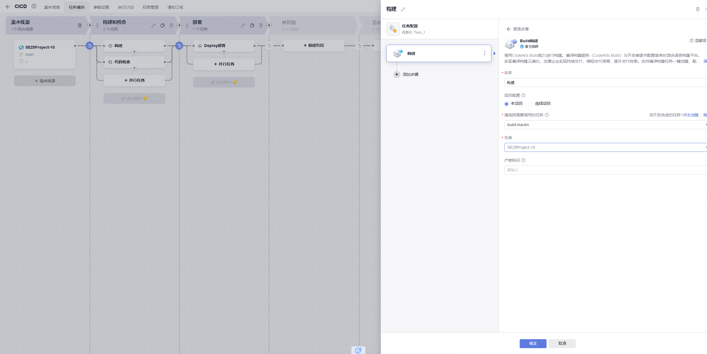

# CI/CD实践文档

## ECS配置与成本

### 配置

#### 基础配置
- **计费模式**: 按需计费
- **区域/可用区**: 华东-上海一 | 可用区3

#### 实例
- **规格**: 通用计算型 | x1.2u.2g | 2vCPUs | 2GiB

#### 操作系统
- **镜像**: Windows Server 2022 标准版 64位 中文_40GB/深圳市伊登软件有限公司
- **主机安全**: 已开启基础防护 (免费一个月)

#### 存储与备份
- **系统盘**: 通用型SSD, 40GiB

#### 公网访问
- **弹性公网IP**: 全动态BGP | 按带宽计费 | 1 Mbit/s | 随实例释放

### 价格计费

- 按需计费
- 云服务器(¥0.169/小时)
- 云硬盘(¥0.0388/小时)
- 带宽(1 Mbit/s按带宽计费，¥0.063/小时)

### 采购理由

- 此配置平衡了成本与性能，足以支撑项目初期的测试与演示需求，并可根据未来流量方便地进行弹性扩容。
- 2GiB内存为Windows Server 2022和后台服务提供了基本的运行空间，启动后仍有一定余量给我的应用程序，确保服务能够启动并响应请求。
- 此外这个配置能够胜任开发测试环境，或MySQL这类轻量级服务，不会因为资源不足而处处受限。

## CI/CD流水线配置说明

## 项目访问URL

- **CodeArts仓库**：https://codehub.devcloud.cn-east-3.huaweicloud.com/f345988d1a0a46a1a0d3b648cc75047a/SE25Project-10.git
- **仅用于执行构建和部署下载任务的package_url**：https://devrepo.devcloud.cn-east-3.huaweicloud.com/DevRepoServer/v1/files/download?filename=f345988d1a0a46a1a0d3b648cc75047a/Mini12306/Mini12306/Mini12306.jar